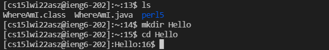
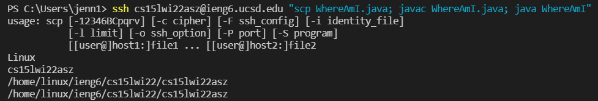

# Lab Report 1: Week 2

## 1. Installing VSCode
> Start by going to the Visual Studio Code's website ([Download VSCode](https://code.visualstudio.com/Download)) to find instructions to download and install it on your system. After successfully installing VSCode, you should have a window similar to the picture below!
<br><br>


## 2. Remotely Connecting
> Since CSE 15L (and many other courses) requires us to connect remotely often, we should learn to use the `ssh` command. First, you need to install the OpenSSH program ([Install OpenSSH](https://docs.microsoft.com/en-us/windows-server/administration/openssh/openssh_install_firstuse)) and follow the instructions to set it up for your system. 
<br><br>
Next, find your course-specific account and reset its password using UCSD's ETS site. ([Find your account](https://sdacs.ucsd.edu/~icc/index.php)) Using a VSCode terminal, type the following command (replacing the `cs15lwi22asz` with your course-specific account):
<br><br>
`ssh cs15lwi22asz@ieng6.ucsd.edu`
<br><br>
There will most likely be a message asking if you're sure you want to connect, since it is your first time connecting to this server. Since you do want to, type `yes`, and press the enter key. Enter your password when prompted, then the terminal will output something like this:
<br><br>


## 3. Trying Some Commands
> To make things easier, especially if you've never used a terminal before, commands are a super helpful way to navigate your files. We can use terminal commands both locally (on our machines) and remotely (while ssh'ed through the internet). The following are fairly common and you'll probably use them frequently in this course:
<br><br>
>
>- `cd <name-of-directory>`
>- `ls`
>- `pwd`
>- `mkdir <name-of-new-directory>`
>- `cp <file-path>`
<br><br>
>
> Try using these commands locally and remotely. The outputs should look similar to the pictures below.
<br><br>


## 4. Moving Files with scp
> This step explains how to copy a file, or files, from your local machine to a remote one using the `scp` command. We can start by making a new local file (on your computer). We'll call it `WhereAmI.java` and put some code in it:
>
```
class WhereAmI {
  public static void main(String[] args) {
    System.out.println(System.getProperty("os.name"));
    System.out.println(System.getProperty("user.name"));
    System.out.println(System.getProperty("user.home"));
    System.out.println(System.getProperty("user.dir"));
  }
}
```
>
> Compile and run this code (`javac` and `java`, respectively) on your machine to see what it says. 
<br><br>
> Now we can use the `scp` command! In your terminal type the following (again, using your account name instead):
<br><br>
`scp WhereAmI.java cs15lwi22asz@ieng6.ucsd.edu:~/`
<br><br>
> To check if the file was properly copied over, log into your account using the `ssh` command and use the `ls` command to check if it's there. Now, you can compile and run the code on the server using the same commands you used to locally run it. 
<br><br>
> Hopefully, you'll see something like this after compiling and running `WhereAmI.java`:
<br><br>


## 5. Setting an SSH Key
> As you may have noticed, every time we log into our accounts using `ssh`, we have to enter our password (without being able to see it too). We can avoid this by using something called `ssh` keys. To start, type the command: 
<br><br>
`ssh-keygen`
<br><br>
> It will prompt you to enter which file to save the key. You can enter the suggested one, shown in parentheses, or you can choose a different place. When done press enter. Next, it will ask you to make a password. Enter one or just press enter if you don't want one. 
<br><br>
> Now, we created both a public key and a private key file ("id_rsa" and "id_rsa.pub" respectively) stored under ".ssh" on your computer. The output from the `ssh-keygen` command probably looks like a jumble of letters, numbers, and symbols as your key's fingerprint, and its randomart image.
> For Windows users, there are extra steps involving the command `ssh-add`. [ssh-add steps](https://docs.microsoft.com/en-us/windows-server/administration/openssh/openssh_keymanagement#user-key-generation)
<br><br>
> Using the `scp` command, we can copy the public one to the server (your course account) and keep the private one on the client (your machine). Start by `ssh`'ing into your remote account, enter the password, and create a new directory called ".ssh" (`mkdir .ssh`). Now logout of your account (`logout`). We can use the following command to copy the public key file into the new directory (replacing the account with your course-specific account and your-username with your username on your machine).
<br><br>
`scp /Users/<your-username>/.ssh/id_rsa.pub cs15lwi22asz@ieng6.ucsd.edu:~/.ssh/authorized_keys`
<br><br>
> Now you can log into your account through `ssh` without entering your password!
<br><br>


## 6. Optimizing Remote Connecting
> Using everything we've used so far, we can try making up new ways to make `ssh`'ing easier and faster, while compiling and running our code remotely. Terminal commands like `ls` and `cd` along with keyboard shortcuts (Ctrl + c, Ctrl + v) make it easier for us to test/run/submit our code. 
<br><br>

<br><br>
> We can use such shortcuts to keep our keystroke count low. In addition to the terminal commands and keyboard shortcuts, we can run multiple commands in one line using semicolons and quotation marks. For example:
<br><br>
`ssh cs15lwi22asz@ieng6.ucsd "scp WhereAmI.java; javac WhereAmI.java; java WhereAmI"`
<br><br>
ssh's into your course account, copies the file to the account, compiles, and runs the file all in one line with about 80 keystrokes, if you type all of it out. Using the mouse to select the text and keyboard shortcuts like "Ctrl + c" and "Ctrl + v" to copy and paste certain parts ("`WhereAmI`" or "`ssh cs15lwi22asz@ieng6.ucsd.edu`" from previous commands) you can greatly reduced the amount of keystrokesto about 30. 
<br><br>
