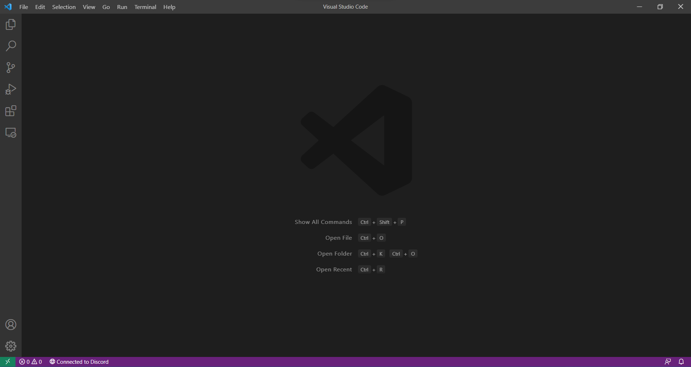
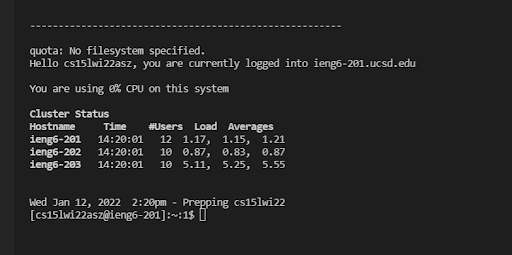
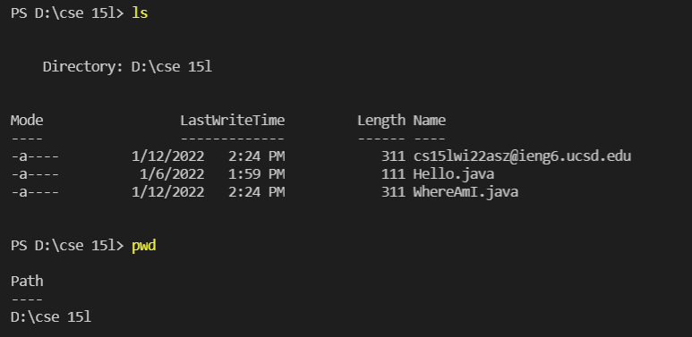
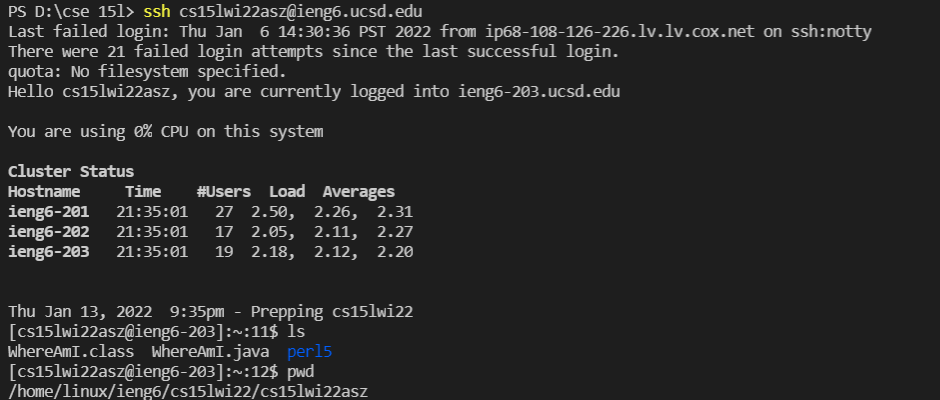
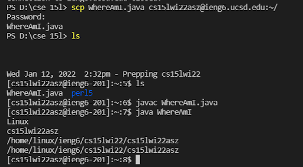
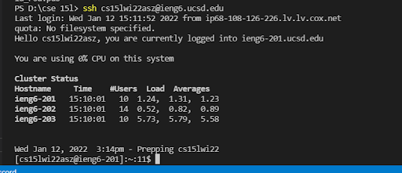

## 1. Installing VSCode
> Start by going to the Visual Studio Code's website ([Download VSCode](https://code.visualstudio.com/Download)) to find instructions to download and install it on your system. After successfully installing VSCode, you should have a window similar to the picture below!
<br><br>



## 2. Remotely Connecting
> Since CSE 15L (and many other courses) requires us to connect remotely often, we should learn to use the `ssh` command. First, you need to install the OpenSSH program ([Install OpenSSH](https://docs.microsoft.com/en-us/windows-server/administration/openssh/openssh_install_firstuse)) and follow the instructions to set it up for your system. 
<br><br>
Next, find your course-specific account and reset its password using UCSD's ETS site. ([Find your account](https://sdacs.ucsd.edu/~icc/index.php)) Using a VSCode terminal, type the following command (replacing the `cs15lwi22asz` with your course-specific account):
<br><br>
`ssh cs15lwi22asz@ieng6.ucsd.edu`
<br><br>
There will most likely be a message asking if you're sure you want to connect, since it is your first time connecting to this server. Since you do want to, type `yes`, and press the enter key. Enter your password when prompted, then the terminal will output something like this:
<br><br>



## 3. Trying Some Commands
> To make things easier, especially if you've never used a terminal before, commands are a super helpful way to navigate your files. We can use terminal commands both locally (on our machines) and remotely (while ssh'ed through the internet). The following are fairly common and you'll probably use them frequently in this course:
<br><br>
>
>- `cd <name-of-directory>`
>- `ls`
>- `pwd`
>- `mkdir <name-of-new-directory>`
>- `cp <file-path>`
<br><br>
>
> Try using these commands locally and remotely. The outputs should look similar to the pictures below.
<br><br>




## 4. Moving Files with scp
> This step explains how to copy a file, or files, from your local machine to a remote one using the `scp` command. We can start by making a new local file (on your computer). We'll call it `WhereAmI.java` and put some code in it:
>
```
class WhereAmI {
  public static void main(String[] args) {
    System.out.println(System.getProperty("os.name"));
    System.out.println(System.getProperty("user.name"));
    System.out.println(System.getProperty("user.home"));
    System.out.println(System.getProperty("user.dir"));
  }
}
```
>
> Compile and run this code (`javac` and `java`, respectively) on your machine to see what it says. 
<br><br>
> Now we can use the `scp` command! In your terminal type the following (again, using your account name instead):
<br><br>
`scp WhereAmI.java cs15lwi22asz@ieng6.ucsd.edu:~/`
<br><br>
> To check if the file was properly copied over, log into your account using the `ssh` command and use the `ls` command to check if it's there. Now, you can compile and run the code on the server using the same commands you used to locally run it. 
<br><br>
> Hopefully, you'll see something like this after compiling and running `WhereAmI.java`:
<br><br>


## 5. Setting an SSH Key
> As you may have noticed, every time we log into our accounts using `ssh`, we have to enter our password (without being able to see it too). We can avoid this by using something called `ssh` keys

talk about ssh keygen BRIEFLY
there are extra steps for windows users
steps for moving public .ssh file
describe jumble of letters numbers symbols for key randomart, key fingerprint



## 6. Optimizing Remote Connecting
