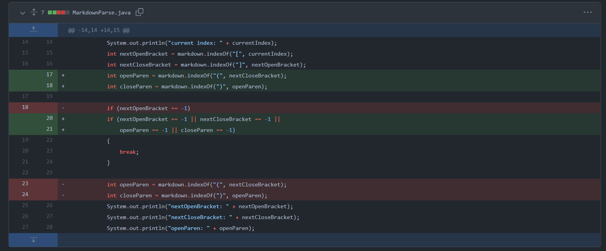
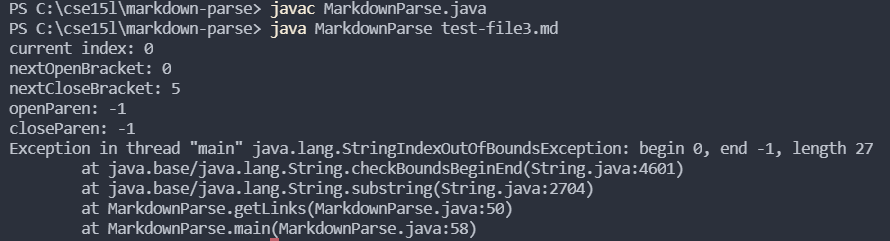

# Lab Report 2: Week 4

## Code Change 1
1. 
2. [Failure-Inducing Output File](https://github.com/jhxyjhxy/markdown-parse/blob/main/test-file3.md)
3. Symptom: 
  

4. The symptom was that there was an IndexOutOfBounds Exception when trying to run the file with test-file3.md. Since there was no way to handle if there were no parentheses, 