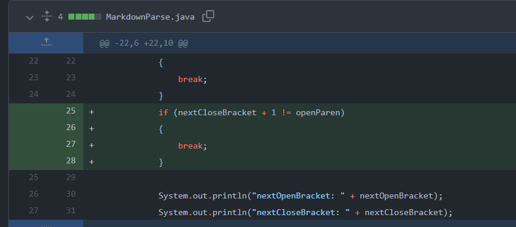
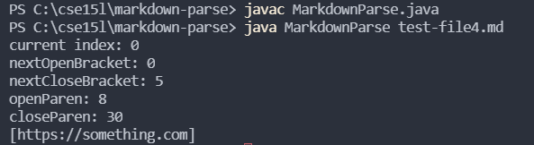
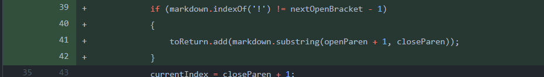
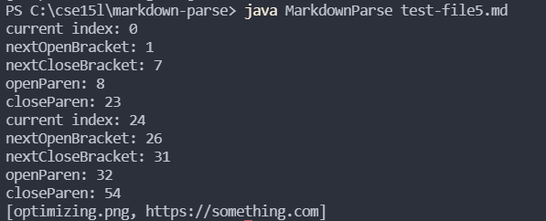

# Lab Report 2: Week 4

## Code Change 1
>1. The change:
  

  
>2. [Failure-Inducing Input File](https://github.com/jhxyjhxy/markdown-parse/blob/main/test-file3.md)
  
>3. Symptom: 
  

  
>4. The symptom was that there was an IndexOutOfBounds Exception when trying to run `MarkdownParse.java` with `test-file3.md`. There was no way to handle a markdown file if there were no parentheses. `test-file3.md` contains a url with brackets, but no parentheses.
  

## Code Change 2
>1. The change:
  

  
>2. [Failure-Inducing Input File](https://github.com/jhxyjhxy/markdown-parse/blob/main/test-file4.md)
  
>3. Symptom:
  

  
>4. The symptom was that the output for the test file contained the URL, even though it was invalid. `test-file4.md` contains a link with brackets and parentheses, but there is a space/line-break between the closing bracket and opening parenthesis. The output should instead be empty brackets since the link isn't valid.
  

## Code Change 3
>1. The change:
  

  
>2. [Failure-Inducing Input File](https://github.com/jhxyjhxy/markdown-parse/blob/main/test-file5.md)
  
>3. Symptom:
  

  
>4. The symptom was that the output for the test file contained the image, even though it is not a valid website URL. `test-file5.md` contains a valid image and a valid link. The output should only contain the website URL instead of both the image and the URL.
  