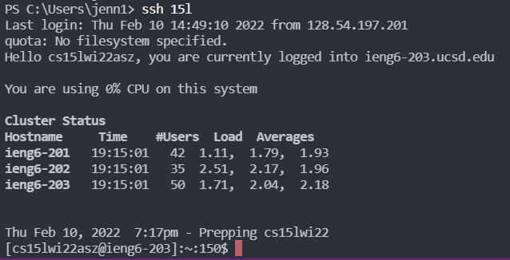
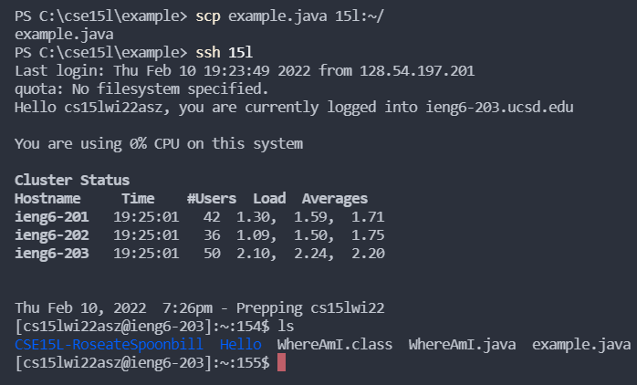

# Lab Report 3: Week 6

## Group Choice 1: Streamline `ssh` Configuration
>1. To make it easier and faster to log into the remote server, we edited (or made if it didn't alrady exist) the `config` file in `~/.ssh`. I used vim to edit the `config` file with my VSCode terminal and chose "15l" as my alias. 
  

  
>2. Now, when I type `ssh 15l`, I log into the account without needing to type my full username.
  

  
>3. I can also now use the `scp` command similarly, without typing out my full username and still get the same result.
  
