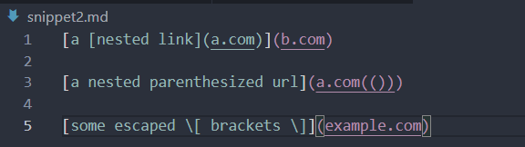
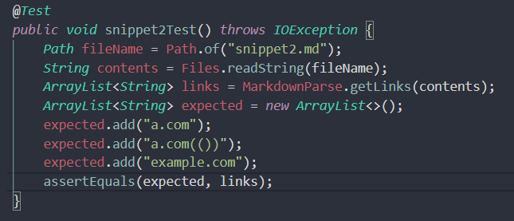
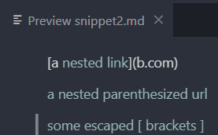
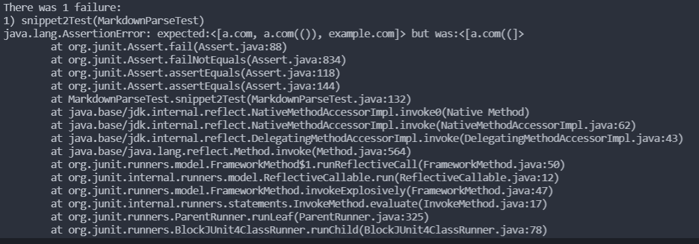
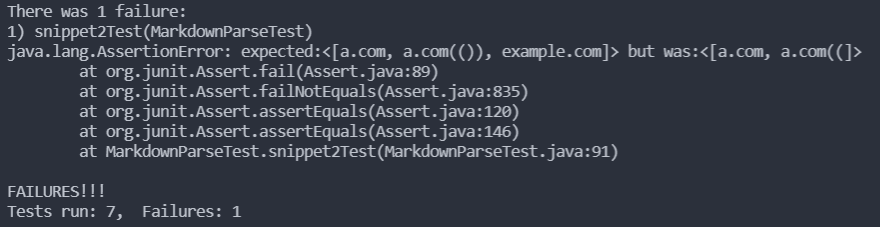
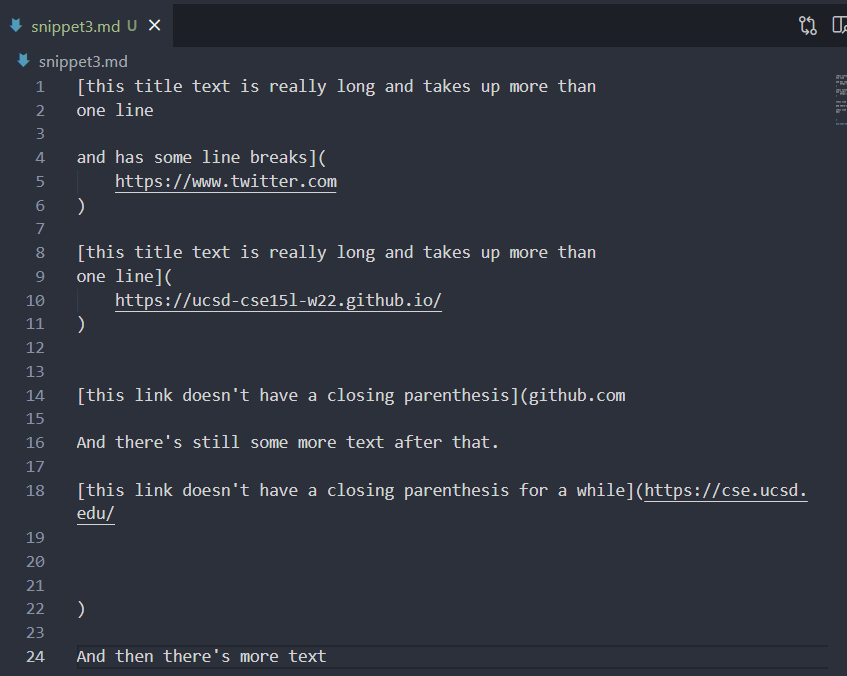
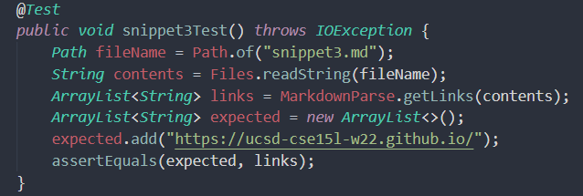
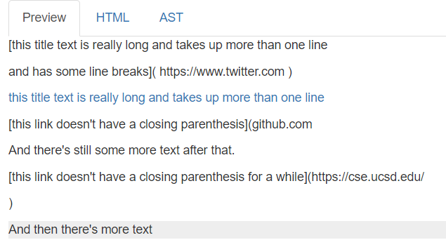
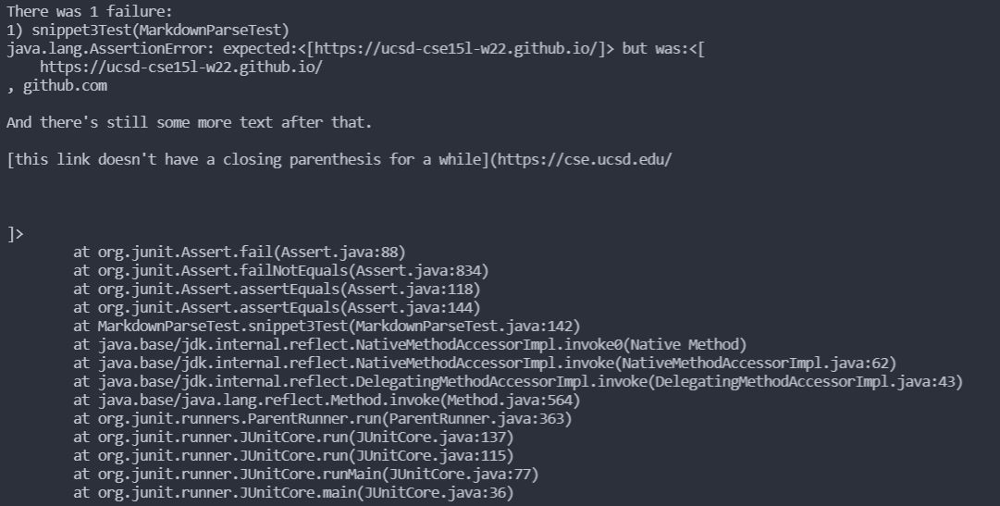
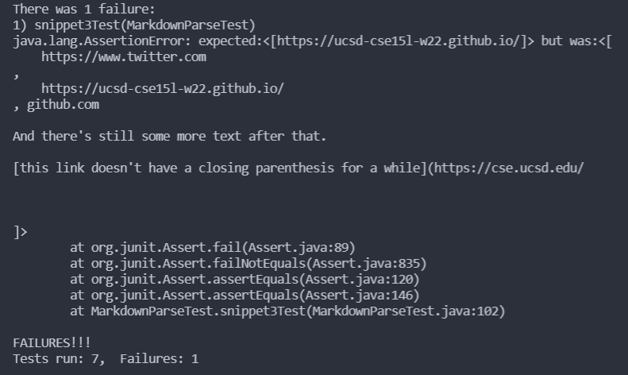

# Lab Report 4: Week 8

## Links
>- [my `markdown-parse` repo](https://github.com/jhxyjhxy/CSE15L-RoseateSpoonbill)
>- [repo that we reviewed](https://github.com/Shree-G/markdown-parse)

## Snippet 1
- The program should print ["`google.com", "google.com", "ucsd.edu"]
<br><br>
- Turning the snippet into a JUnit test: <br>


<br><br>
- Snippet 1's preview: <br>

<br><br>
- My repo's test result: The test failed because our code doesn't handle how inline code blocks could affect the URL.<br>

<br><br>
- Reviewed repo's test result: The test failed as well because their code similarly doesn't handle how inline code blocks affect the URL. However, their code does handle code blocks using three backticks ("\```"). <br>

<br><br>
- I think there is a small code change that would make the program work for this snippet. The program could include an `indexOf` check for the "\`" character and then use a `continue` statement, which would take less than 10 lines of code. 
<br><br>

## Snippet 2
- The program should print ["a.com", "a.com(())", "example.com"]
<br><br>
- Turning the snippet into a JUnit test: <br>


<br><br>
- Snippet 2's preview: <br>

<br><br>
- My repo's test result: The test failed as our code didn't handle if a valid link was nested inside another link and if there were parentheses nested in a valid link. The loop broke before reaching the third link ("example.com"). <br>

<br><br>
- Reviewed repo's test result: The test also failed since it didn't handle the parentheses nested inside a valid link. The loop also broke before reaching the third link. However, it did handle the nested valid link and returned it correctly. <br>

<br><br>
- I don't think there is a small code change that would make the program work for this snippet. It would be a more involved change because each of the different links would need their own change in the program for our repo. For the repo we reviewed, there only has to be two changes, but it would still take more than 10 lines of code. 
<br><br>

## Snippet 3
- The program should print ["https://ucsd-cse15l-w22.github.io/"]
<br><br>
- Turning the snippet into a JUnit test: <br>


<br><br>
- Snippet 3's preview: <br>

<br><br>
- My repo's test result: The test failed because our program sees the fourth link's ("https://cse.ucsd.edu/") closing parenthesis as the third link's ("github.com") since there is no closing parenthesis for the third link. Because of this, all the text between the third link and the fourth link is included as the third link's URL. <br>

<br><br>
- Reviewed repo's test result: The test failed for the same reason. In addition, "https://www.twitter.com" is also included as a valid link even though it shouldn't because there are link breaks in the brackets.<br>

<br><br>
- I think there is a small code change that would make the program work for this snippet. There should be a check to see if there is or isn't a closing parenthesis before the next open bracket. If there isn't one then it should not be a valid link. 
<br><br>