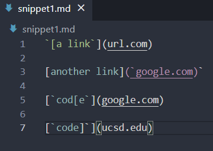
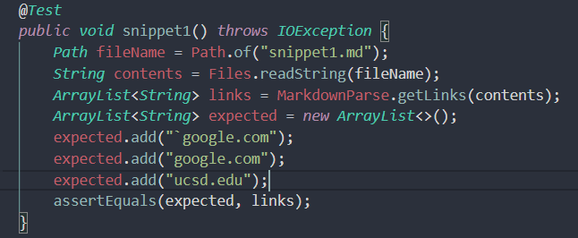
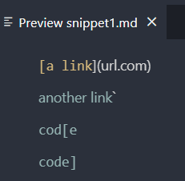
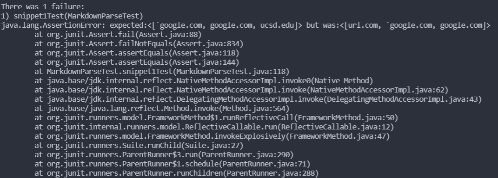
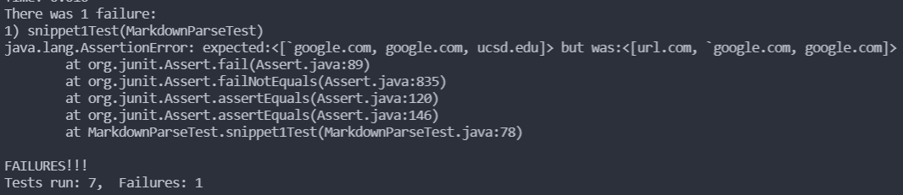

# Lab Report 4: Week 8

## Links
>- [my `markdown-parse` repo](https://github.com/jhxyjhxy/CSE15L-RoseateSpoonbill)
>- [repo that we reviewed](https://github.com/Shree-G/markdown-parse)

## Snippet 1
- The program should print ["`google.com", "google.com", "ucsd.edu"]
  
- Turning the snippet into a JUnit test:  

  
- Snippet 1's preview:  

  
- My repo's test result: The test failed because our code doesn't handle how code blocks could affect the URL. 

  
- Reviewed repo's test result: The test failed as well because their code similarly doesn't handle how code blocks affect the URL.  

  
- I think there is a small code change that would make the program work for this snippet. The program could include an indexOf check for the "`" character. 

Do you think there is a small (<10 lines) code change that will make your program work for snippet 1 and all related cases that use inline code with backticks? If yes, describe the code change. If not, describe why it would be a more involved change.