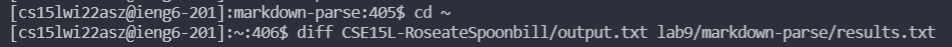
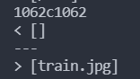
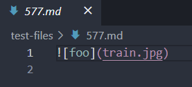
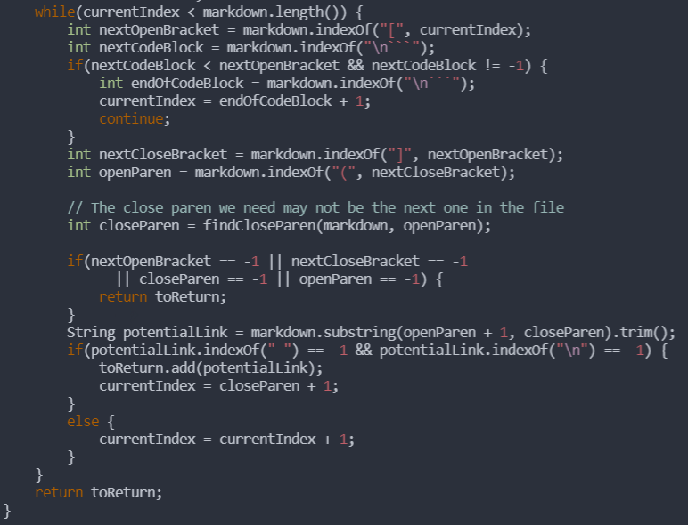
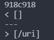
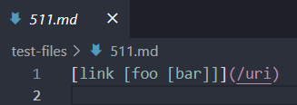
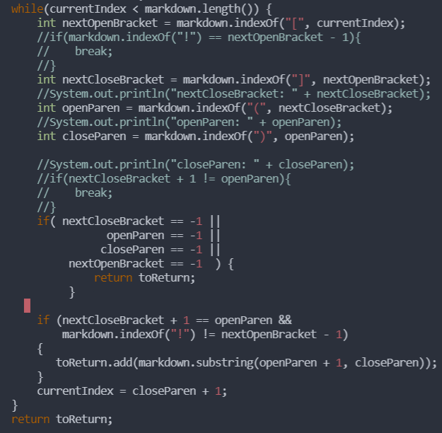

# Lab Report 5: Week 10

## Finding the Tests
>To find the tests, I ran the `diff` command. I started by running:
  
`bash script.sh > output.txt`
  
>in our repository on ieng6 to get the output of running each test file in the `test-files` folder in the repo into a `.txt` file `output.txt`. I ran the same command in the `markdown-parse` repo, but instead called the output file `results.txt`.
  

  
>The `diff` command output which lines the differences were on for each file, but these don't correspond to which test file they were from. To find the tests, I used the command:
  
`vim results.txt`
  
>I then typed `:set number` inside the vim editor to toggle on line numbers. After finding the right line, I could see which test file caused the difference, since our `script.sh` file has the following line:
  
`echo $file`
  
>I used this procedure to find each of the test files for both bugs.

 

## Bug 1
>`diff` output:
  

  
>Test file: `test-files/577.md`
  

  
>Our implementation is correct for this test. `577.md` only contains an image, which should not be counted as a website URL. The other implementation, however, does include "train.jpg" as a valid link.
  
>In the incorrect implementation, there should be some sort of check for an image. The `while` loop in the `ArrayList<String> getLinks(String markdown)` method should be where this check is.
  

  
>Our implementation checks if there is a "!" after checking if any of the indices of the next open bracket, next closed bracket, open parenthesis, and closed parenthesis are -1, meaning they don't exist.

 

## Bug 2
>`diff` output:
  

  
>Test file: `test-files/511.md`
  

  
>The other implementation is correct for this test. `511.md` contains a valid link. Our implementation does not account for the nested brackets. 
  
>To fix this, our implementation should handle the case of nested brackets by making sure there are more or the same number of closing brackets as opening brackets before the opening parenthesis, where the URL is found. This fix should be added in the `while` loop in the `ArrayList<String> getLinks(String markdown)` method.
  
